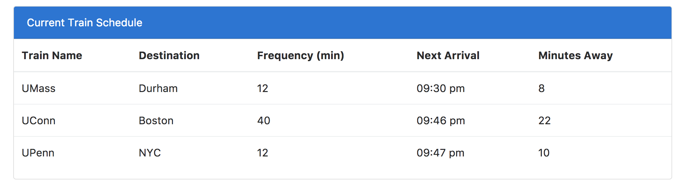
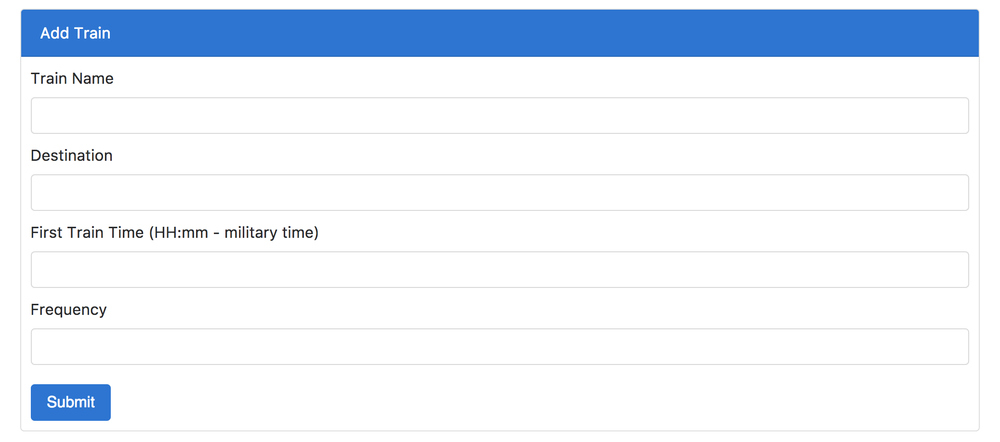

# TrainTime

Created during Week 7 of Bootcamp. Firebase Application to accept input from user to create a fictional train list and calculate the next train and minutes away.


## Screen Shot

List of trains saved to the Firebase Database.


Form to create new trains to add to the database.

## Technologies used
- jQuery
- Firebase

### Prerequisites

```
- jQuery: visit http://code.jquery.com/ and link in html
- Firebase: https://firebase.google.com/
```

## Built With

* Sublime Text - Text Editor
* Bootstrap - Wireframe

## Authors

* **Mary Doucet** - *HTML/CSS/JS* - [Mary Doucet](https://github.com/medoucet720)
